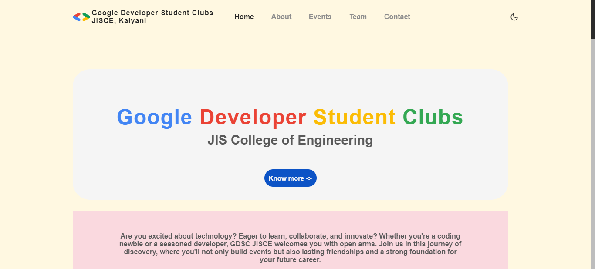

# GDSC-JISCE Website

Welcome to the GDSC-JISCE (Google Developer Student Clubs - JISCE) website repository! This website showcases the activities, events, and information related to our GDSC chapter at JISCE.

## Table of Contents

- [About](#about)
- [Features](#features)
- [Technologies Used](#technologies-used)
- [Getting Started](#getting-started)
- [Usage](#usage)
- [Contributing](#contributing)
- [License](#license)

## About

GDSC-JISCE is a student community that focuses on learning, collaboration, and creating impactful projects. This website serves as a platform to engage with students interested in technology and provide them with information about our events, workshops, and projects.

## Features

- Interactive and responsive design.
- Showcase of upcoming and past events.
- Details about GDSC-JISCE team members.
- Slide shows to highlight event photos.

## Technologies Used

- HTML
- CSS
- JavaScript

## Getting Started

To run the website locally on your machine, follow these steps:

1. Clone this repository: `git clone https://github.com/devayanm/GDSC-JISCE.git`
2. Navigate to the project directory: `cd your-repo`
3. Open the `index.html` file in your web browser.

## Usage

Browse the website to:
- Explore upcoming events and workshops.
- Get to know our GDSC-JISCE team members.
- View photos from past events.
- RSVP for upcoming events.

## Contributing

We welcome contributions from the community! If you'd like to contribute to the project, please follow these steps:

1. Fork this repository.
2. Create a new branch: `git checkout -b feature/new-feature`
3. Make your changes and commit them: `git commit -m "Add a new feature"`
4. Push to the branch: `git push origin feature/new-feature`
5. Create a pull request.

## License

This project is licensed under the [MIT License](LICENSE).
